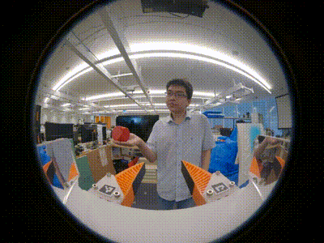

# Human Intention Motion Prediction with Visuomotor Diffusion Policy (HIMPVDP)

[Dinh Dang Khoa Le](https://profiles.uts.edu.au/DinhDangKhoa.Le)<sup>1</sup>,
[Maleen Jayasuriya](https://profiles.uts.edu.au/Gibson.Hu)<sup>2</sup>,
[Gibson Hu](https://www.linkedin.com/in/maleennj/)<sup>1</sup>,
[Dikai Liu](https://profiles.uts.edu.au/Dikai.Liu)<sup>1</sup>,
<sup>1</sup>Robotics Institute (RI), University of Technology Sydney,
<sup>2</sup>Associated to the Collaborative Robotics Lab (CRL), University of Canberra,


## Installation - Only tested on Ubuntu 20.04
For Universial Manipulation Interface installation and training please follow the step at: [UMI](https://umi-gripper.github.io/)

For Zed SDK installation please follow the step at: [ZED2](https://www.stereolabs.com/docs/installation/linux)

For Cuda installation in Conda please follow step 9 at: [CUDA In Conda](https://docs.nvidia.com/cuda/cuda-installation-guide-linux/#conda-installation)

## VDP training
Train the static handover tasks using UMI framework, instruction is shown at: [UMI](https://umi-gripper.github.io/)

The video below show the data collection for static handover task.




## Human motion prediction data collection
Activate umi environment
```console
$ conda activate umi
(umi)$ 
```

Run body tracker recoding file
```console
(umi)$ cd hmpar_former/TF/body_tracker
(umi)$ python3 bodytrack_zed.py
```
Note: Change the raw data directory path to your computer directory path. Press "q" to save the file, and update the counter number for each recording. 

## Human motion prediction training data

Install Jupiter Notebook for training
```console
(umi)$ pip install notebook
```
Preprocess data: hmpar_former/data_process/preprocess_norm_zed.ipynb

Training file: hmpar_former/TF/TF_Train_V3 Maleen.ipynb

Validation file: hmpar_former/TF/TF_Inf V3 Maleen.ipynb

Note: Change the process_data directory path and model path to your computer directory path.


## HIMP+VDP evaluation
Grant permission to the HDMI capture card.
```console
(umi)$ sudo chmod -R 777 /dev/bus/usb
```

Launch evaluation script
```console
(umi)$ python3eval_real.py --robot_config=example/eval_robots_config.yaml -i ckpt/latest_block_from_people.ckpt -o data pick_block_from_people
```
Note: There is an option to switch between using LSTM and our Transformer human motion prediction network in the script file.


## Video experiments
Please find the project video at: [HIMPVDP](https://www.youtube.com/watch?v=VYSy_hbDPFc)

